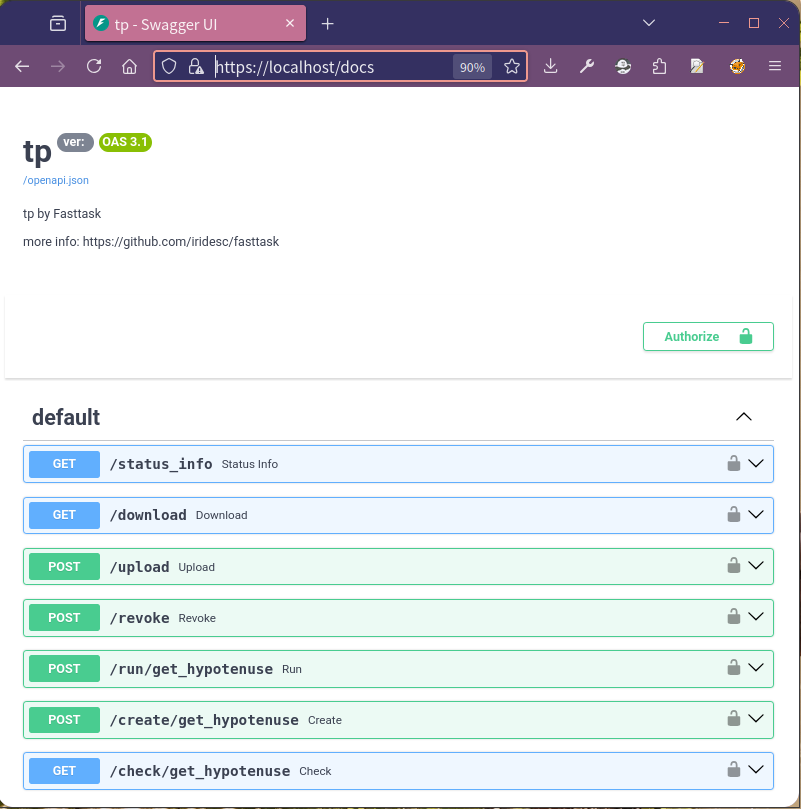
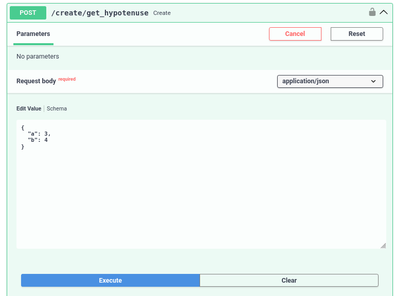
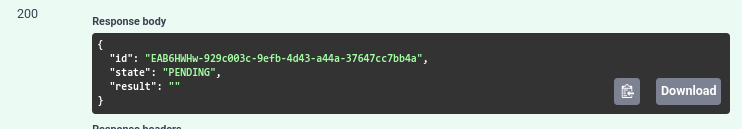
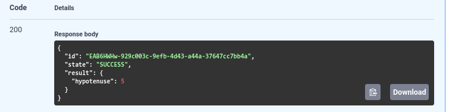

FastTask 分布式任务平台

# 简介
    实现你的python函数，并以异步+分布式（可选）形式部署， 以提供权限控制的https接口可靠调用

# 特性
FastTask提供以下核心功能：

    1. 快速开发部署：定义输入输出， 实现你的函数， 打包镜像, 然后在任何容器化环境下部署

    2. 分布式： 轻松扩展，单节点 + 分布式部署，适用于各种规模和需求
 
    3. 通用交互： 使用fastapi + uvicorn 构建http api接口， 在任何语言环境调用

    4. 可靠的结果： rdb 持久化任务数据+执行时间限制， 即使在分布式场景， 极差的网络环境， 不稳定的宿主环境下， 仍然能有效保证任务结果， 对于异常任务会返回完整异常以定位业务问题

    5. 轻量： 基于python：slim， celery+redis, fasttapi+uvicorn

    6. 可控的任务类型执行： 通过ENABLED_TASKS， DISABLED_TASKS 控制具体某个节点可以执行/不可以执行那些任务


# 开始使用

1. 安装管理工具[fasttask_manager](https://github.com/iridesc/fasttask_manager)

    ```bash
    pip install fasttask_manager
    ```

2. 使用管理工具创建项目
    ```bash
    python -m fasttask_manager.create_project
    project name:test_project
    port (default:80):
     ```

    然后你会得到下面的目录结构
    ```bash
    ./test_project
    ├── docker-compose.yml
    ├── Dockerfile
    ├── requirements.txt # python依赖
    ├── setting.py 
    └── tasks
        ├── get_hypotenuse.py # 任务代码
        └── packages
            └── tools.py # 需要的一些工具函数
    ```
3. 增加依赖 !!

    在```test_project/requirements.txt```中增加你python的依赖
    在```test_project/Dockerfile``` 中增加你的环境依赖

4. 实现你的函数

    参考 ```get_hypotenuse.py```注意以下几点实现你的函数：

    - 任务文件名， 与内部的任务函数名需要保持一致， fasttask会自动注册函数到api接口
    - 这里 Params， Result 继承 BaseModel，Params中属性与你函数参数名一一致。 另外详细的输入输出定义有以下好处：
        - 会自动校验，以保证输出输出的确定性
        - 自动生成的接口文档页面会有详细的输入输出定义
    - 你的结果需要以 ```result.model_dump()```输出


    ```python
    from typing import Union
    from pydantic import BaseModel

    from packages.tools import xx, sleep_random


    class Params(BaseModel):
        a: Union[float, int]
        b: Union[float, int]


    class Result(BaseModel):
        hypotenuse: Union[float, int]


    def get_hypotenuse(a, b):
        if a <= 0 or b <= 0:
            raise ValueError("side length must > 0")
        print("running...")
        sleep_random()
        result = Result(hypotenuse=(xx(a) + xx(b))**0.5)
        return result.model_dump()
    ```


5. 打包运行
    ```bash
    docker build -t 'test_project:latest' . &&  docker compose up -d
    ```

6. 调用
    访问 ```https://localhost/docs```
    
    
    
    你会看到以下接口：

    - status_info:  返回服务状态信息
    - download:  下载文件接口
    - upload:  上传文件接口
    - revoke:  撤销任务接口
    - run/get_hypotenuse 同步调用你在tasks中实现的任务
    - create/get_hypotenuse 创建异步任务接口
    - check/get_hypotenuse 检测任务状态(获取任务结果)接口

    你可以：
    - 点击 ```try it out``` 直接填写参数调用
    - python代码通过[fasttask_manager](https://github.com/iridesc/fasttask_manager)调用
    - 其他代码直接请求接口

    以get_hypotenuse为例进行异步调用：
    - 在create 接口中填写参数 点击 execute后会拿到任务id
    
    
    - 在check接口中填写任务id 点击execute后，会返回任务结果
    

# 分布式部署

需要两个docker compose：
- master节点 

    ```yaml
    services:
    master:
        image: tes_project:latest
        container_name: fasttask-master
        restart: always

        ports:
        - "9001:443"
        - "9000:6379"

        volumes:
        - ./files-master:/fasttask/files

        environment:
        - NODE_TYPE=distributed_master
        - TASK_QUEUE_PASSWD=passwd
    ```

    - 6379为redis任务队列端口，其他worker需要连接到该端口
    - NODE_TYPE需要设置为distributed_master， 表示该节点为分布式master节点
    - TASK_QUEUE_PASSWD为redis密码，其他worker需要连接到该密码


- worker节点 
    ```yaml
    services:
    worker-get_hypotenuse:
        image: tes_project:test
        container_name: worker-get_hypotenuse
        restart: always

        volumes:
        - ./files-worker:/fasttask/files

        environment:
        - NODE_TYPE=distributed_worker
        - MASTER_HOST=10.65.8.8
        - TASK_QUEUE_PORT=9000
        - TASK_QUEUE_PASSWD=passwd

    ```
    - NODE_TYPE: 需要设置为distributed_worker
    - MASTER_HOST: master节点的ip
    - TASK_QUEUE_PORT: master节点的任务队列端口
    - TASK_QUEUE_PASSWD: master节点的任务队列密码

# 认证

当存在有效的```files/fasttask/conf/user_to_passwd.json```时， 自动启用认证功能， 文件内容参考：
```json
{
"user_A": "user_A_passwd",
"user_B": "user_B_passwd"
}
```

# 文件
你可以通过upload接口上传你任务中所必要的文件，这个文件被放在```/fasttask/files/0caee52c-b2ca-4c04-b040-82bd952192da_1.xlsx```目录下， 你的任务代码可以打开并处理文件

当任务结果需要输出到文件时， 你可以把文件保存在```/fasttask/files/0caee52c-b2ca-4c04-b040-82bd952192da_1.xlsx```， 然后你可以调用download接口下载文件。


# 核心配置

- **SOFT_TIME_LIMIT**： 运行时间限制， 单位秒， 配置时默认为1天， 超过该时间任务进程会被直接杀死， 任务状态会变为失败
- **RESULT_EXPIRES**： 结果过期时间， 单位秒， 配置时默认为3天， 超过该时间任务结果会被删除
- **WORKER_CONCURRENCY**： 并发数， 默认为cpu核数
- **API_x**： 接口是否启用配置，默认为 True，比如 API_RUN为 False时, 所有任务的run接口都会被禁用
- **ENABLED_TASKS**： 逗号分隔的任务名称列表（例如 get_circle_area,get_hypotenuse）。如果设置，此 Worker 只会处理这些指定的任务。优先级高于 - DISABLED_TASKS。
- **DISABLED_TASKS**：逗号分隔的任务名称列表。如果设置，此 Worker 将不处理这些指定的任务。

更多配置餐参考[./fasttask/run.py](https://github.com/iridesc/fasttask/blob/main/fasttask/run.py) env_type_to_envs

# todo
- 在认证通过前 不展示 docs页面
- check 接口增加任务创建 更新时间
- 实现自定义的并发控制
- 基于结果有效时间，自动清理文件
