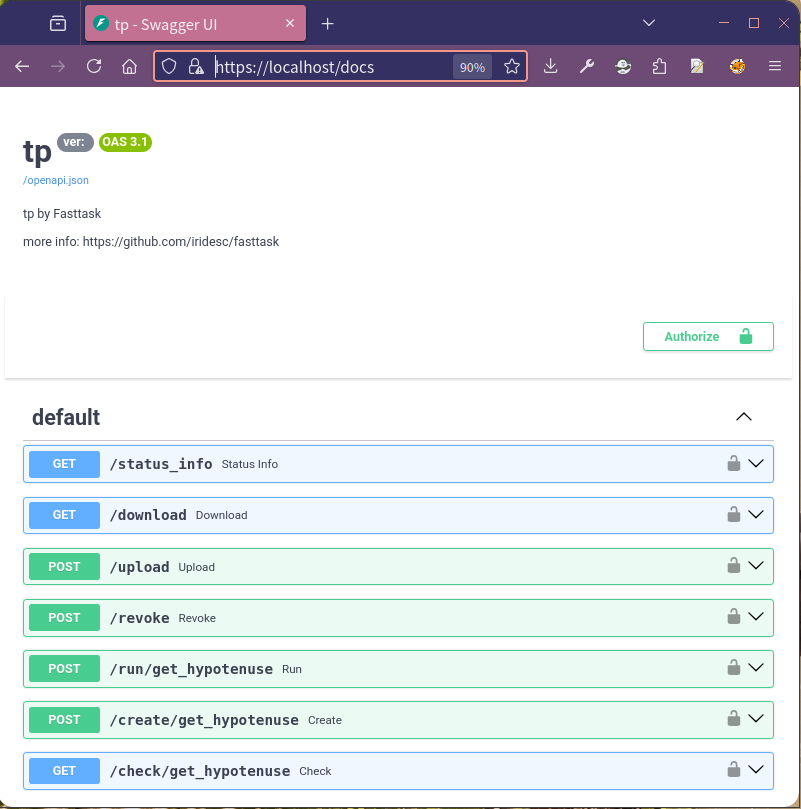
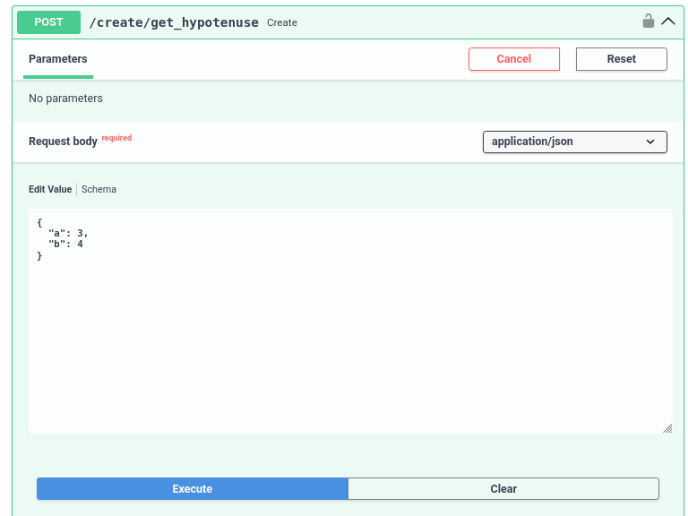
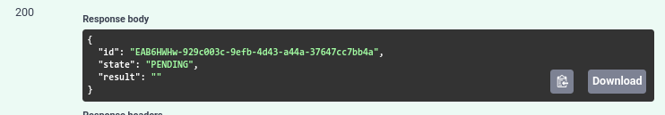
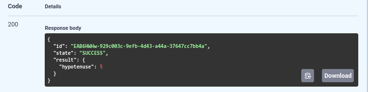

# FastTask 分布式任务平台

# 简介
    实现你的 Python 函数，并以异步+分布式（可选）形式部署，以提供权限控制的 HTTPS 接口可靠调用。

# 特性
FastTask 提供以下核心功能：

    1. 快速开发部署：定义输入输出，实现你的函数，打包镜像，然后在任何容器化环境下部署

    2. 分布式：轻松扩展，单节点 + 分布式部署，适用于各种规模和需求

    3. 通用交互：使用 FastAPI + Uvicorn 构建 HTTP API 接口，在任何语言环境调用

    4. 可靠的结果：RDB 持久化任务数据 + 执行时间限制，即使在分布式场景、极差的网络环境、不稳定的宿主环境下，仍然能有效保证任务结果，对于异常任务会返回完整异常以定位业务问题

    5. 轻量：基于 `python:slim` Docker 镜像，Celery + Redis，FastAPI + Uvicorn

    6. 可控的任务类型执行：通过 `ENABLED_TASKS`、`DISABLED_TASKS` 控制具体某个节点可以执行/不可以执行哪些任务


# 开始使用

1. 安装管理工具 [fasttask_manager](https://github.com/iridesc/fasttask_manager)

    ```bash
    pip install fasttask_manager
    ```

2. 使用管理工具创建项目
    ```bash
    python -m fasttask_manager.create_project
    project name:test_project
    port (default:80):
    ```

    然后你会得到下面的目录结构
    ```bash
    ./test_project
    ├── docker-compose.yml
    ├── Dockerfile
    ├── requirements.txt  # Python 依赖
    ├── setting.py
    └── tasks
        ├── get_hypotenuse.py  # 任务代码
        └── packages
            └── tools.py  # 需要的一些工具函数
    ```

3. 增加依赖 !!

    在 `test_project/requirements.txt` 中增加你的 Python 依赖
    在 `test_project/Dockerfile` 中增加你的环境依赖

4. 实现你的函数

    参考 `get_hypotenuse.py` 注意以下几点实现你的函数：

    - 任务文件名与内部的任务函数名需要保持一致，fasttask 会自动注册函数到 API 接口
    - 这里 Params、Result 继承 BaseModel，Params 中属性与你函数参数名一致。另外详细的输入输出定义有以下好处：
        - 会自动校验，以保证输入输出的确定性
        - 自动生成的接口文档页面会有详细的输入输出定义
    - 你的结果需要以 `result.model_dump()` 输出


    ```python
    from typing import Union
    from pydantic import BaseModel

    from packages.tools import xx, sleep_random


    class Params(BaseModel):
        a: Union[float, int]
        b: Union[float, int]


    class Result(BaseModel):
        hypotenuse: Union[float, int]


    def get_hypotenuse(a, b):
        if a <= 0 or b <= 0:
            raise ValueError("side length must > 0")
        print("running...")
        sleep_random()
        result = Result(hypotenuse=(xx(a) + xx(b))**0.5)
        return result.model_dump()
    ```


5. 打包运行

    项目提供了示例 compose 文件，位于 `samples/` 目录：
    - `samples/docker-compose-single_node.yml` — 单节点部署
    - `samples/docker-compose-distributed.yml` — 分布式部署

    ```bash
    docker build -t 'test_project:latest' . && docker compose -f samples/docker-compose-single_node.yml up -d
    ```

6. 调用
    访问 `https://localhost/docs`

    

    你会看到以下接口：

    - `status_info`：返回服务状态信息（POST 方法，body 参数 `fields` 可选值：`worker_status`、`task_info`、`pending_task_count`）。固定返回字段包括 `running_id`（服务实例标识）、`username`（当前认证用户）；当 `fields` 包含 `task_info` 时，还会为每个已加载的任务返回 `task_info_{task_name}` 字段，提供按任务维度的统计信息。
    - `download`：下载文件接口（GET 方法，query 参数 `file_name`）
    - `upload`：上传文件接口（POST 方法，上传文件）
    - `revoke`：撤销任务接口（POST 方法，body 参数 `{result_id: "xxx"}`）
    - `run/get_hypotenuse`：同步调用你在 tasks 中实现的任务
    - `create/get_hypotenuse`：创建异步任务接口
    - `check/get_hypotenuse`：检测任务状态（获取任务结果）接口（GET 方法，query 参数 `result_id`）

    你可以：
    - 点击 `try it out` 直接填写参数调用
    - Python 代码通过 [fasttask_manager](https://github.com/iridesc/fasttask_manager) 调用
    - 其他代码直接请求接口

    以 `get_hypotenuse` 为例进行异步调用：
    - 在 create 接口中填写参数，点击 execute 后会拿到任务 ID
    
    
    - 在 check 接口中填写任务 ID，点击 execute 后会返回任务结果
    

# 分布式部署

> 完整的 compose 文件参见 `samples/docker-compose-distributed.yml`。

分布式部署需要两类节点：

- **master 节点**：提供 API 服务 + Redis 任务队列，不执行任务

    ```yaml
    services:
      master:
        image: test_project:latest
        container_name: fasttask-master
        restart: always

        ports:
          - "9001:443"   # API 端口
          - "9000:6379"   # Redis 端口（供 Worker 连接）

        volumes:
          - ./files:/fasttask/files

        environment:
          - NODE_TYPE=distributed_master
          - TASK_QUEUE_PASSWD=passwd
          - FLOWER_ENABLED=True
    ```

    - 6379 为 Redis 任务队列端口，其他 Worker 需要连接到该端口
    - `NODE_TYPE` 需要设置为 `distributed_master`，表示该节点为分布式 master 节点
    - `TASK_QUEUE_PASSWD` 为 Redis 密码，其他 Worker 需要使用相同密码连接

- **worker 节点**：只执行任务，不提供 API 服务

    ```yaml
    services:
      worker-get_hypotenuse:
        image: test_project:latest
        container_name: worker-get_hypotenuse
        restart: always

        volumes:
          - ./files-worker_1:/fasttask/files

        environment:
          - NODE_TYPE=distributed_worker
          - MASTER_HOST=master
          - TASK_QUEUE_PORT=6379
          - TASK_QUEUE_PASSWD=passwd
          - ENABLED_TASKS=get_hypotenuse
          - WORKER_TAG=get_hypotenuse
          - FLOWER_ENABLED=True
    ```

    - `NODE_TYPE`：需要设置为 `distributed_worker`
    - `MASTER_HOST`：master 节点的 Docker 服务名或 IP 地址
    - `TASK_QUEUE_PORT`：master 节点的任务队列端口（默认 6379）
    - `TASK_QUEUE_PASSWD`：master 节点的任务队列密码
    - `ENABLED_TASKS` / `DISABLED_TASKS`：控制该 Worker 只执行或排除特定任务
    - `WORKER_TAG`：Worker 标识标签，用于区分不同 Worker
    - Worker 节点不需要暴露端口（仅连接 Master 的 Redis）

## Worker 标识与任务路由

`WORKER_TAG` 用于在分布式部署中标识和区分不同的 Worker 节点。它在以下场景中发挥作用：

**Flower 监控识别**：每个 Worker 在 Flower 面板中会显示对应的 `WORKER_TAG`，方便运维人员快速定位问题节点。例如 `WORKER_TAG=get_hypotenuse` 的 Worker 在 Flower 中会明确显示为处理 `get_hypotenuse` 任务的节点。

**配合任务过滤实现专用节点**：结合 `ENABLED_TASKS` 或 `DISABLED_TASKS`，可以构建按任务拆分的专用 Worker 池：

```yaml
# 专用 Worker：只执行 get_circle_area 任务
worker-circle:
  environment:
    - NODE_TYPE=distributed_worker
    - ENABLED_TASKS=get_circle_area
    - WORKER_TAG=circle_worker

# 通用 Worker：排除 get_circle_area，处理其他所有任务
worker-general:
  environment:
    - NODE_TYPE=distributed_worker
    - DISABLED_TASKS=get_circle_area
    - WORKER_TAG=general_worker
```

**单节点默认行为**：`single_node` 模式下 `WORKER_TAG` 默认为 `"worker"`；`distributed_worker` 模式下也默认为 `"worker"`，建议按实际任务角色设置有意义的值。

# 并发控制

FastTask 支持任务级别的并发控制。在调用任务时，可以通过 `fasttask_concurrency_params` 参数限制同一任务的并发执行数量。

参数说明：
- `concurrency_key`：并发控制的标识 key（必需），相同 key 的任务共享并发限制
- `max_concurrency`：最大并发量（默认 16）
- `countdown`：获取锁失败后的退避等待时间（默认 60 秒）
- `expire`：锁的过期时间（默认 30 分钟），避免死锁

使用示例：
```json
{
  "fasttask_concurrency_params": {
    "concurrency_key": "user_123",
    "max_concurrency": 5,
    "countdown": 30,
    "expire": 600
  },
  // 其他任务参数...
}
```

# Flower 监控

FastTask 集成了 [Flower](https://flower.readthedocs.io/) 作为 Celery 任务监控工具。通过设置 `FLOWER_ENABLED=True` 启用。

启用后可通过 `/flower` 路径访问 Flower Web UI 和 API：
- Web UI：`https://localhost/flower/` — 查看任务、Worker、队列状态
- API：`https://localhost/flower/api/workers`、`/flower/api/tasks` 等

认证说明：
- Flower 路径复用 FastTask 的 HTTP Basic 认证（`user_to_passwd.json`）
- 若未配置认证文件，则无需认证即可访问

相关配置：
- **FLOWER_ENABLED**：是否启用 Flower（默认 `False`）
- **FLOWER_PORT**：Flower 服务内部端口（默认 `5555`）
- **FLOWER_MAX_TASKS**：Flower 保留的最大任务数量（默认 `1000`）

# 认证

当存在有效的 `files/fasttask/conf/user_to_passwd.json` 时，自动启用认证功能，文件内容参考：
```json
{
  "user_A": "user_A_passwd",
  "user_B": "user_B_passwd"
}
```

# 文件管理

你可以通过 upload 接口上传你任务中所必要的文件，这个文件被放在 `/fasttask/files/` 目录下（例如 `0caee52c-b2ca-4c04-b040-82bd952192da_1.xlsx`），你的任务代码可以打开并处理文件。

当任务结果需要输出到文件时，你可以把文件保存在 `/fasttask/files/` 目录下，然后调用 download 接口通过 `file_name` 参数下载文件（例如 `result_export.csv`）。

## 文件过期清理

FastTask 内建文件自动过期删除机制，由 Supervisor 管理的独立进程负责执行。

清理规则：
- 基于文件最后修改时间（mtime）判断是否过期，过期后直接删除
- 递归扫描 `files/` 下所有子目录（始终跳过 `files/fasttask/` 系统目录）
- 支持通过 `FILE_CLEANUP_SKIP_PATTERNS` 配置额外的跳过路径（逗号分隔的相对路径，相对于 `files/` 目录）
- 文件删除后若所在目录为空，一并清理空目录
- 每 10 分钟执行一次清理扫描

相关配置：
- **FILE_CLEANUP_ENABLED**：是否启用文件清理（默认 `True`）。设为 `False` 时，清理进程不会启动
- **FILE_EXPIRATION_SECONDS**：文件过期时间（秒），默认为 `SOFT_TIME_LIMIT` × 10（约 10 天）。当 `FILE_CLEANUP_ENABLED=True` 时，该值必须 ≥ 60 秒，否则系统启动会报错退出
- **FILE_CLEANUP_SKIP_PATTERNS**：清理时需要额外跳过的路径（逗号分隔，相对于 `files/` 目录）。例如 `".lazy_action,.disk_cache_reset.lock"` 可跳过指定的文件/目录。默认为空（仅跳过 `files/fasttask/`）。配置的路径不存在时不会报错


# 核心配置

## 部署与网络

- **NODE_TYPE**：部署模式，必填。可选值：`single_node`（单节点）、`distributed_master`（分布式 Master）、`distributed_worker`（分布式 Worker）
- **MASTER_HOST**：Master 节点的 Docker 服务名或 IP 地址。Worker 通过此地址连接 Redis 队列，`single_node` 默认为 `0.0.0.0`
- **TASK_QUEUE_PORT**：Redis 任务队列端口。`single_node` 和 `distributed_master` 默认为 `6379`
- **TASK_QUEUE_PASSWD**：Redis 密码。`single_node` 默认为 `passwd`；`distributed_master` 和 `distributed_worker` 为必填
- **UVICORN_WORKERS**：Uvicorn worker 数量，默认为 2

## 任务执行

- **SOFT_TIME_LIMIT**：运行时间限制，单位秒，默认为 1 天（86400 秒），超过该时间任务进程会被直接杀死，任务状态变为失败
- **TIME_LIMIT**：硬超时时间，单位秒，默认为 `SOFT_TIME_LIMIT + 60` 秒，任务达到此时间会被强制终止
- **VISIBILITY_TIMEOUT**：Celery broker 可见性超时，单位秒，默认为 `TIME_LIMIT + 60` 秒，任务在此时间内未被处理会重新入队
- **RESULT_EXPIRES**：结果过期时间，单位秒，默认为 3 天（259200 秒），超过该时间任务结果会被删除
- **WORKER_CONCURRENCY**：Worker 并发数，默认为 CPU 核数
- **WORKER_POOL**：Worker 池类型，默认为 `prefork`，可选 `gevent`
- **WORKER_TAG**：Worker 标识标签，用于区分不同 Worker，默认 `"worker"`
- **ENABLED_TASKS**：逗号分隔的任务名称列表（例如 `get_circle_area,get_hypotenuse`）。如果设置，此 Worker 只会处理这些指定的任务。优先级高于 `DISABLED_TASKS`
- **DISABLED_TASKS**：逗号分隔的任务名称列表。如果设置，此 Worker 将不处理这些指定的任务

## 结果存储

任务返回时会先用任务自定义的 `Result` 模型做结构校验（校验失败 → 任务直接失败，`result_type` 为 `text`），
再按配置决定结果去向。

- **RESULT_TYPE**：结果存储方式，默认 `JSON`
  - `JSON`：结果内联在 Celery backend（Redis），行为与历史版本完全一致
  - `S3`：结果一律上传对象存储，Redis 只保留引用
  - `AUTO`：序列化后超过 `RESULT_AUTO_TO_S3_SIZE` 才上传对象存储
- **RESULT_AUTO_TO_S3_SIZE**：`AUTO` 模式的阈值（字节），默认 `1048576`（1MB）
- **RESULT_TO_S3_TRIES**：结果上传对象存储的重试次数，默认 `3`；重试后仍失败则该任务失败
- **S3_PORT**：内嵌对象存储的监听端口，默认 `9000`
- **S3_ENDPOINT**：对象存储地址。**不配置时自动推导**：master / single_node 使用 `127.0.0.1:$S3_PORT`，worker 使用 `$MASTER_HOST:$S3_PORT`（即内嵌对象存储）。只有改用外部对象存储时才需显式指定
- **S3_PUBLIC_ENDPOINT**：预签名下载地址对外暴露的地址（域名或 `宿主IP:端口`）。**容器部署时必须配置**，否则下载地址会指向容器内的 `127.0.0.1`，下载方无法访问
- **S3_BUCKET**：桶名，默认 `fasttask-results`
- **S3_PREFIX**：对象 key 前缀，多服务共用一个桶时用于隔离，默认为空
- **S3_REGION**：区域，默认 `us-east-1`
- **S3_SECURE**：是否使用 HTTPS 连接对象存储，默认 `False`
- **S3_VERIFY_SSL**：是否校验对象存储的 TLS 证书，默认 `True`（自签证书场景可设为 `False`）
- **S3_PRESIGN_EXPIRES**：预签名下载地址有效期（秒），默认与 `SOFT_TIME_LIMIT` 相同
- **S3_ACCESS_KEY** / **S3_SECRET_KEY**：对象存储凭据。**不配置时由 `TASK_QUEUE_PASSWD` 派生**，master 与所有 worker 自动得到同一份凭据，通常无需配置

当 `RESULT_TYPE` 为 `S3`/`AUTO` 时，启动会做前置校验：`S3_PRESIGN_EXPIRES` 与 `RESULT_EXPIRES` 都必须小于
`FILE_EXPIRATION_SECONDS`，避免出现“下载地址有效但对象已被清理”的悬空引用。

### 内嵌对象存储

镜像内置了 [versitygw](https://github.com/versity/versitygw)（Apache-2.0）作为 S3 兼容对象存储，
无需额外部署就能启用结果外置：

- 仅在提供 API 的节点（`single_node` / `distributed_master`）启动，worker 只作为客户端连过来
- 数据存放在 `files/fasttask/s3/`（即已挂载的 `files` 卷内，无需额外卷）
- 凭据默认由 `TASK_QUEUE_PASSWD` 派生，master 与所有 worker 自动得到同一份，**无需任何额外配置**
- master 启动 `uvicorn` 时会自检并自动创建 bucket；配置错误会在启动阶段就暴露
- 过期结果对象由清理进程按 `FILE_EXPIRATION_SECONDS` 删除（只在 `single_node` / `distributed_master` 执行）

因此启用外置存储只需一个环境变量：

```yaml
environment:
  - RESULT_TYPE=AUTO        # 或 S3
```

注意：预签名下载地址由客户端直接访问对象存储，所以容器部署时还需要：

1. **映射对象存储端口**：`ports: ["9000:9000"]`（端口可改）
2. **告诉框架对外地址**：`S3_PUBLIC_ENDPOINT=<客户端可达的宿主地址或域名>:<映射后的端口>`

如果客户端与服务端在同一网络（如内网直连、无容器隔离），不配 `S3_PUBLIC_ENDPOINT` 也能直接使用。

要改用外部对象存储（MinIO / Ceph / 云厂商 S3 兼容服务）时，显式配置 `S3_ENDPOINT`、`S3_ACCESS_KEY`、
`S3_SECRET_KEY`（以及必要的 `S3_PUBLIC_ENDPOINT`）即可，框架侧无需改动。

结果查询接口（`/check/{task_name}`）新增 `result_type` 字段标识 `result` 的类型：

- `json`：`result` 为任务定义的 `Result` 结构（与历史版本一致）
- `s3`：`result` 为对象存储引用（`uri` / `url` / `size_bytes` / `sha256` / `expires_at`），
  `url` 是可直接下载的预签名地址，**无需额外凭据**
- `text`：`result` 为错误信息（失败时为完整 traceback）或任务状态字符串

## 接口控制

以下开关控制各类 API 接口是否启用，默认均为 `True`：

- **API_RUN**：是否启用 `/run/{task_name}` 同步执行接口
- **API_CREATE**：是否启用 `/create/{task_name}` 异步创建接口
- **API_CHECK**：是否启用 `/check/{task_name}` 结果查询接口
- **API_REVOKE**：是否启用 `/revoke` 任务撤销接口
- **API_FILE_DOWNLOAD**：是否启用 `/download` 文件下载接口
- **API_FILE_UPLOAD**：是否启用 `/upload` 文件上传接口
- **API_STATUS_INFO**：是否启用 `/status_info` 状态查询接口
- **API_DOCS**：是否启用 `/docs` Swagger 文档页面
- **API_MCP**：是否启用 [MCP 端点](#mcp-端点)，默认 `False`

## MCP 端点

FastTask 可以把现有接口自动翻译成 MCP 工具，供 AI 客户端直接调用。

- **API_MCP**：是否启用 MCP 端点，默认 `False`

启用后端点为 `https://<host>:<port>/mcp`，用 HTTP 传输接入：

```bash
claude mcp add --transport http fasttask https://10.0.0.1:9001/mcp \
  --header "Authorization: Basic $(echo -n 'user:passwd' | base64)"
```

工具按 `API_*` 开关动态注册，新增任务无需任何额外改动（任务文件放进 `tasks/` 即自动出现）：

| 工具 | 对应接口 | 启用条件 |
|---|---|---|
| `create_<task>` | `POST /create/<task>` | `API_CREATE` |
| `check_<task>` | `GET /check/<task>` | `API_CHECK` |
| `run_<task>` | `POST /run/<task>` | `API_RUN` |
| `fasttask_status` | `POST /status_info` | `API_STATUS_INFO` |
| `fasttask_revoke` | `POST /revoke` | `API_REVOKE` |

工具参数直接来自任务自己的 `Params` 模型（字段说明、默认值、约束都会带到 MCP schema 里）；
任务的模块 docstring 会作为工具说明的一部分，建议给每个任务写一句用途说明。

`check_*` 的返回值遵循 `/check` 的 `result_type` 约定：小结果直接返回；
外置到对象存储的结果只返回引用与预签名下载地址，调用方下载到本地后再解析，
避免把几十 MB 的结果灌进模型上下文。

认证复用 FastTask 既有的凭据：`user_to_passwd.json` 存在时要求 HTTP Basic，
不存在时匿名放行（与其它接口完全一致）。

注意事项：

- 客户端访问 `/mcp` 时会经历一次 307 跳转（`/mcp` → `/mcp/`），官方 MCP 客户端会自动跟随
- 容器使用自签证书时，客户端需要信任该证书（如 Node 系客户端设置 `NODE_EXTRA_CA_CERTS`）
- MCP 传输为无状态模式：任务状态由 `result_id` 定位，服务重启后依然可用
- 工具数量随任务数增长（每个任务最多 3 个），可用 `ENABLED_TASKS` 控制暴露范围

## 响应压缩

- **RESPONSE_COMPRESS**：是否启用响应 gzip 压缩，默认为 `True`。仅在客户端发送 `Accept-Encoding: gzip` 时生效，未声明该头的客户端收到的响应与压缩前完全一致；压缩在线程池中执行，不会阻塞事件循环。`/download`、`/flower` 以及 `text/event-stream` 响应会自动跳过。小于 1000 字节的响应不压缩
- **RESPONSE_COMPRESS_LEVEL**：gzip 压缩级别，默认为 `5`（范围 0-9）。级别越高压缩率略好但 CPU 开销明显更大：以 55MB 的 JSON 为例，1 级耗时 148ms / 压缩率 15.7%，9 级耗时 1129ms / 压缩率 11.8%。级别越高仅适合客户端链路越慢的场景（客户端带宽低于约 97Mbps 时 5 级才比 1 级划算），内网千兆环境推荐用 3 左右

## Flower 监控

- **FLOWER_ENABLED**：是否启用 Flower 监控服务（默认 `False`）
- **FLOWER_PORT**：Flower 服务内部端口（默认 `5555`）
- **FLOWER_MAX_TASKS**：Flower 保留的最大任务数量（默认 `1000`）

## 文件清理

- **FILE_CLEANUP_ENABLED**：是否启用文件过期清理（默认 `True`）。设为 `False` 则清理进程不启动
- **FILE_EXPIRATION_SECONDS**：文件过期时间（秒），默认为 `SOFT_TIME_LIMIT` × 10。当 `FILE_CLEANUP_ENABLED=True` 时，该值必须 ≥ 60 秒，否则系统启动报错退出
- **FILE_CLEANUP_SKIP_PATTERNS**：清理时需要额外跳过的路径，逗号分隔的相对路径（相对于 `files/` 目录），默认为空。配置示例：`".lazy_action,.disk_cache_reset.lock"`

## 调试

- **DEBUG**：是否启用调试模式，默认 `False`，启用后会通过 `LoggingMiddleware` 打印详细请求/响应日志

更多配置参考 [./fasttask/run.py](https://github.com/iridesc/fasttask/blob/main/fasttask/run.py) `env_type_to_envs`

# todo
- 在认证通过前不展示 docs 页面
- check 接口增加任务创建更新时间
